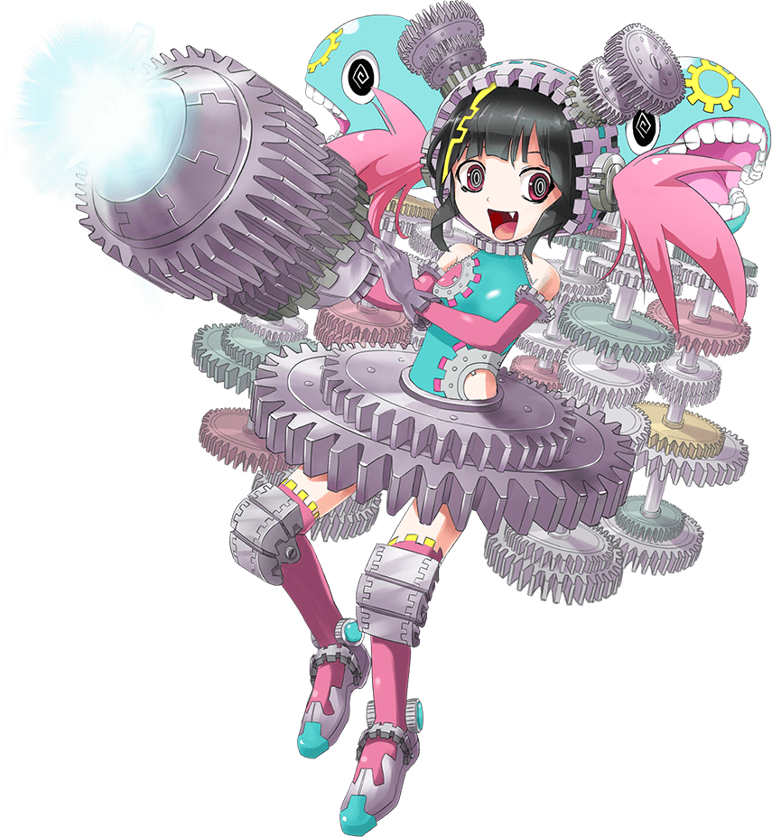
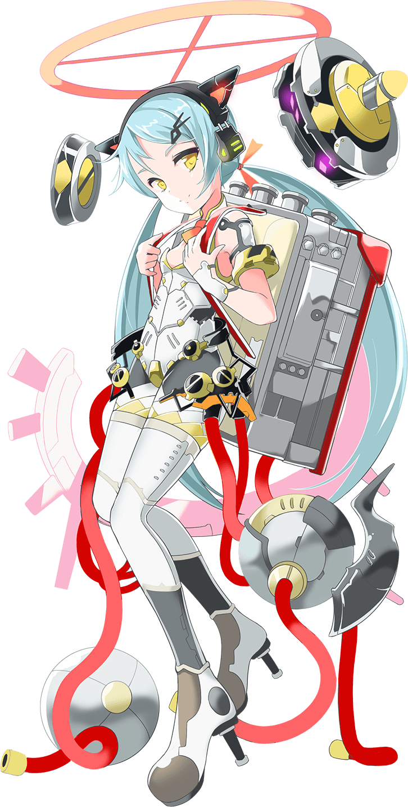
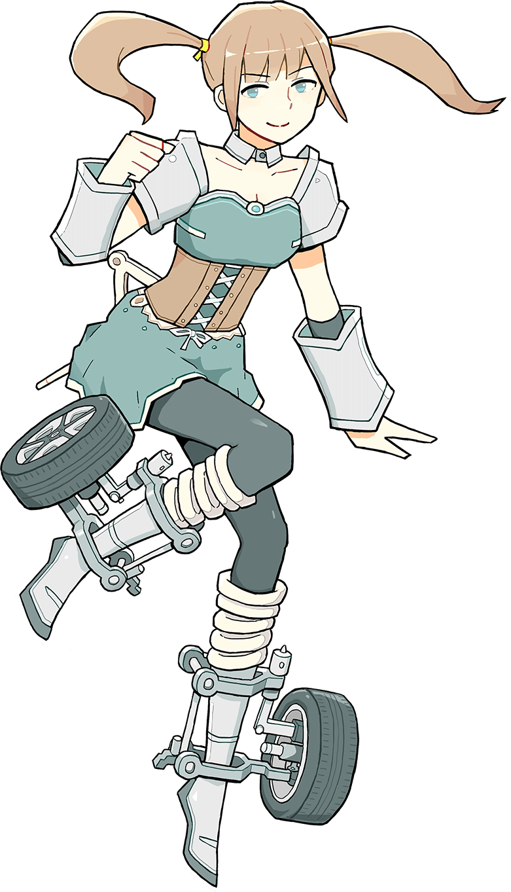
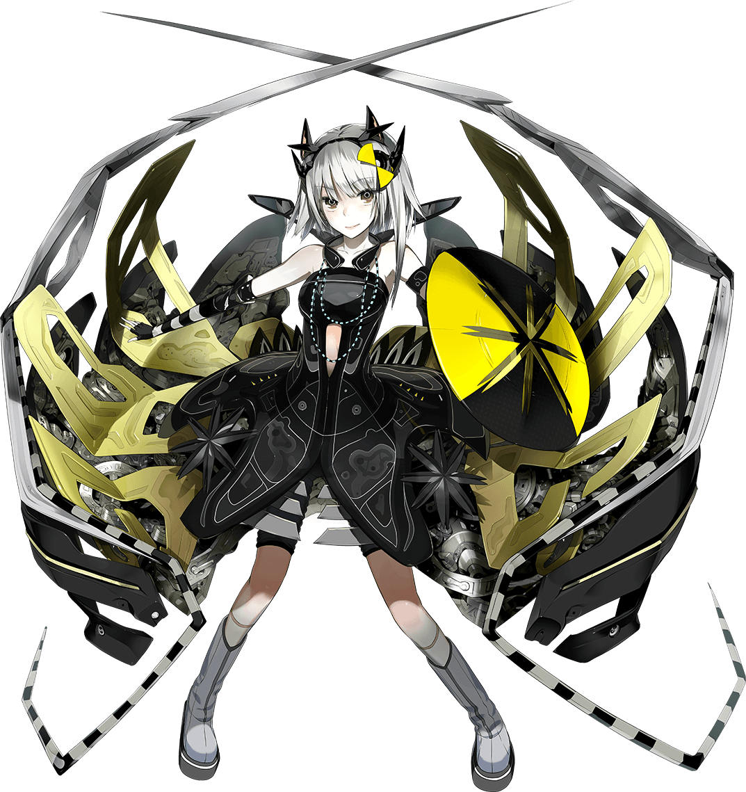
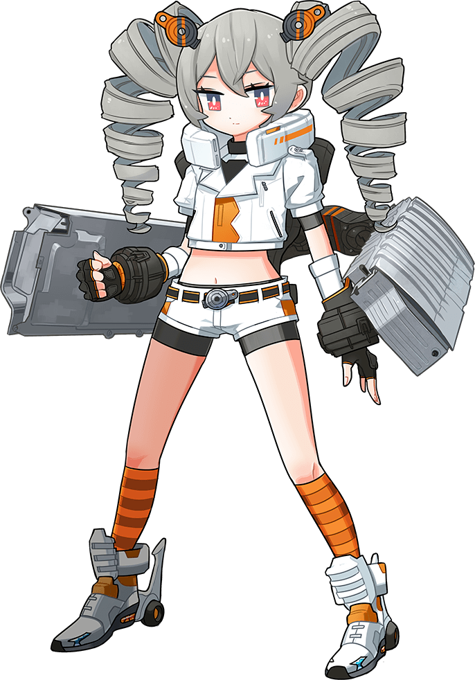
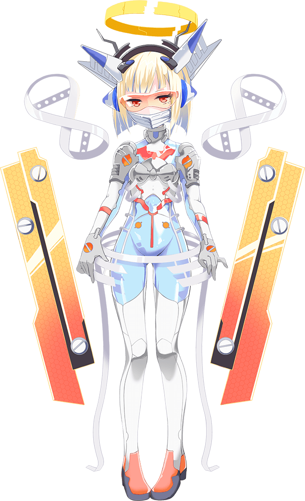
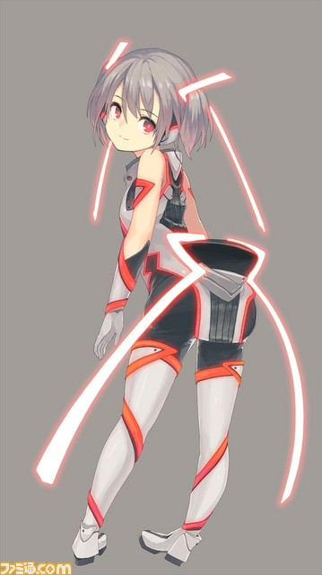
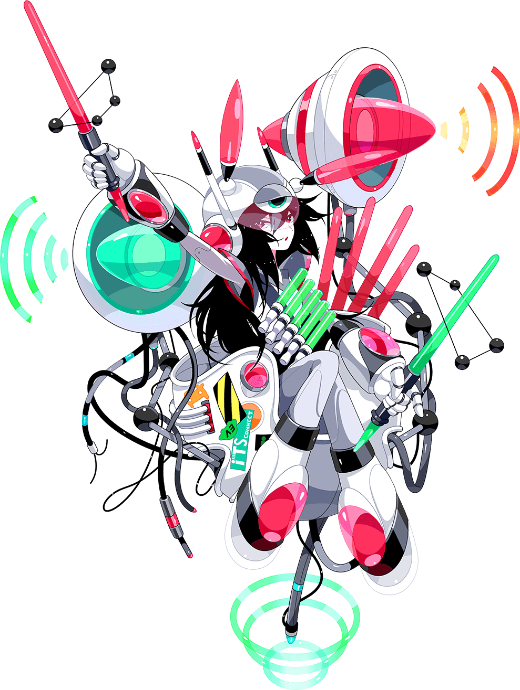

# 1: 2ZR-FXE Engine

# 2: Hybrid Transaxle

# 3: High-Voltage Power Converter

# 4: Dashboard

# 5: Triangular Silhouette

# 6: Double-Wishbone Suspension

# 7: High-Rigidity Body

# 8: TSS-P (Toyota Safety Sense)

# 9: GOA (Global Outstanding Assessment) Body

# 10: Electrical 4WD System

# 11: Soundproofing Performance

# 12: Front of the car

# 13: Back of the car

# 14: Emotional Red color

# 15: Thermo-Tect Lime color

# 16: Motor/generators

# 17: Hybrid Battery

# 18: Grill Shutters

# 19: Exhaust Heat Recovery System

# 20: Electronic Water Pump

# 21: LED Headlamps

# 22: Tail Lights

This was the only one missing from the website, but I found it on another source.

# 23: Alloy Wheels

# 24: Windshield

# 25: 4.2 inch color TFT twin gauges

# 26: Head-Up Display

# 27: Steering Wheel

# 28: Center of Gravity

# 29: Accessory Outlet

# 30 S-FLOW (Smart-Flow) Climate Control System

# 31: Wireless Charging

# 32: Aerodynamic Performance

# 33: Blind Spot Monitor

# 34: Intelligent Clearance Sonar

# 35: Simple Intelligent Park Assist

# 36: Hill Start Assist Control

# 37: EV/ECO/PWR Drive Mode Switch

# 38: iTS Connect

# 39: Door Chime

# 40: Power Mode

------------------------------------------
# Sources

- https://web.archive.org/web/20170608160237/http://toyota.jp/prius/cp/parts
- https://www.famitsu.com/news/201601/18097435.html
